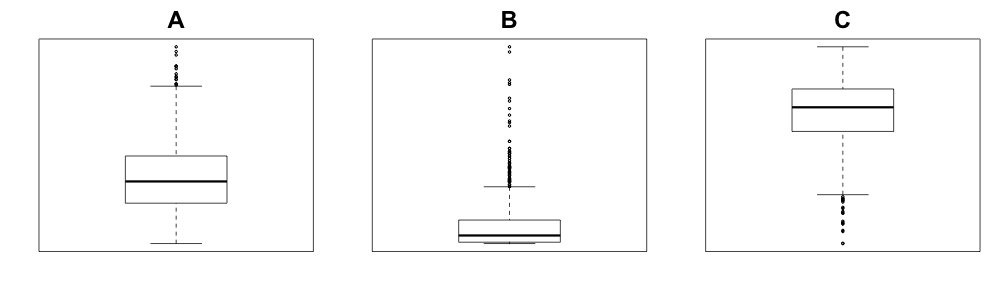
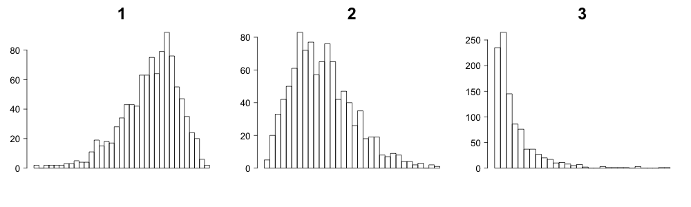

```{r setup, include=FALSE}
knitr::opts_chunk$set(echo = TRUE, tidy.opts=list(width.cutoff=60), tidy=TRUE)
```

# Instructions

## Goals of Homework

In this homework, you should be reviewing the ideas of boxplots, histograms, and continuous distributions, and how to work with them in R. You are also demonstrating basic ability to work in R language and create R markdown files in RStudio.
In addition, there are some probability problems.

## General Instructions:##

This homework is given in the form of a R markdown file (HW1.Rmd) that you have learned about in lab, as well as a "compiled" pdf version for easy reading. To answer these questions, you should open the R markdown file in Rstudio, save it to a new file name (e.g. 'HW1_Purdom.Rmd'). 

Your answers should be inserted into the .Rmd file. If you should do code, we will have provided you with a chunk where you should put your code. If you should answer a question with your words, they should be written after the  `>` symbol.

*Remember to completely answer the question!* For example, if you are asked to make a plot *and* comment on it, don't forget to add the comment! For this homework, we have put prompts like "My answer is ..." to show you how this works; you may replace that with your text.

## Instructions for code chunks

For those questions that request you to edit or create R code, we have already put in R chunks for where your code should go. Depending on the instructions for the questions, inside the chunks you should either correct the existing code or insert the code needed to complete the assignment. **Do not change the names of the R chunks:** our tests as to whether your code works depends on these names. 

If you are asked to use R to find a numeric number,  we will ask you to save your answer with as a particular variable. In order to report this number so that we can grade it you must print it. 

**Example** For example, suppose we ask you to simulate data from a N(0,1), find the median, and then comment whether it is less than 4. We would give you a code chunk that looks like this (notice we set the seed for you so everyone gets the same answer, do not delete this line, nor should you change the seed):

```{r trivialExampleBefore}
set.seed(4291)
# insert code here 
# save the median of your simulated data as 'medx'
```

You might input your code like so:

```{r trivialExampleAfter}
set.seed(4291)
# insert code here 
# save the median of your simulated data as 'medx'
x<-rnorm(1000)
medx<-median(x)
# My answer: the median of x is:
print(medx)
```

And then you would give the answer in a comment following your code. You can also talk about the results of your R code in your answer using the variable you saved. This is useful if you change your code, then your answer will update (though of course not your conclusions!) 

> My answer is that the median of x is `r round(medx,3)`  which is less than 4.

Look at the .Rmd, to see how I put the answer to the R code `round(medx,3)` in my answer. (I use the function `round` to round the data to 3 digits after the decimal to make it readable).

Also notice in the .Rmd how I used the `>` before my answer. This is how you put text in block quotes in Rmarkdown.


## Instructions for Submission

 We have set up the rmarkdown file so that it should compile into a pdf (the default is into html). If you are not working on the server, but on your own laptop, you should test that you can compile this file into pdf before changing it. You should then submit both the \*.pdf and the \*.Rmd file to Gradescope for grading, just like for the labs.

\clearpage
# Questions

**Question 1** (6 points) Below are both the boxplots and frequency histograms of three different datasets. The axes are not labelled to give the actual values of the data, but all three datasets have the same median value. Identify which boxplot goes with which histogram, and explain why.







> My answer is A-2, B-3, C-1. \
From the boxplots, we can see that A and B have many big outliers, thus their frequency histograms might be right skewed, referring to plot 2 and 3. Noticing that the mean and 25 percentile of B are closer to the minumum value than A, thus we can deduct A-2 and B-3. \
The boxplot C has many small outliers, thus its frequency histogram may be left skewed, referring to plot 1.


**Question 2: Simulation from parametric distributions in R:** There are many other standard continuous distributions other than the normal distribution that are important in statistics. Just like the normal distribution, R provides functions to plot their density curves, calculate probabilities, and simulate data.

An example of a common distribution is the F distribution. The functions for this distributions are `df`, `pf` and `rf`; these correspond to the same functions `dnorm`, `pnorm`, and `rnorm` that you have seen for the normal distribution. However, different distributions have different parameters. While the normal distribution has the mean (`mean`) and variance/standard deviation (`sd`), other distributions have other parameters. The F distribution has two parameters called `df1` and `df2` by R (`df` stands for 'degrees of freedom'). We are not going to worry too much right now about what those parameters mean, other than to note that they change the probability distribution.

a. (10 points) Plot the density of a F distribution with parameters `df1=3` and `df2=24` using the density function. Describe how this distribution compares to a normal probability distribution.

```{r densityF}
# Insert code here for plotting the density function.
curve(df(x, df1 = 3, df2 = 24),
      xlim = c(0,5),
      ylab = "density",
      main = "Density of a F Distribution")
```

> My answer is the F distribution is right skewed and not symmetric to its mean value while the normal distribution is symmetric. \
Also, the x range of F distribution is from 0 to $\infty$  while the normal distribution is from $-\infty$ to $\infty$ 

b. (5 points) Find the probability of an observation from this distribution being between 1 and 4, using R commands, and make sure the answer prints out so that it shows up in the pdf.

```{r calculateProbabilityF}
# Insert code here for calculating the probability of being  in [1,4]
# Save the response as 'probF'
probF <- pf(4, df1 = 3, df2 = 24) - pf(1, df1 = 3, df2 = 24)
probF
```

c. (15 points) Now simulate 500 observations from the above F distribution and plot a histogram of the simulated data.  Overlay the true probability density that you plotted above on top of the histogram. Color the true density curve red and make it thicker than the default so that it stands out.

```{r histSimF}
set.seed(51920)
# Insert code here for simulating the data and making a histogram from the data.
# Save the simulated data as `simF`.
simF <- rf(500, df1 = 3, df2 = 24)
hist(simF, freq = FALSE, ylim = c(0, 0.7), xlim = c(0, 6))
curve(df(x, 3, 24), add = TRUE, col = "red", lwd = 5)
```

d. (8 points) Imagine that this simulated data was actually observed data given to you and you didn't know the actual probability distribution of the data. You want to use this simulated data to estimate the probability distribution. What would be your *estimate* of being between between 1 and 4? (calculate it in R using the simulated data and make sure the answer prints out so that it shows up in the pdf). How does it compare to what we know is the actual probability that you calculated in (b) above?

```{r probSimF}
# Insert code here for estimating the probability of being in [1,4]
# from simulated data created in previous chunk.
# Save the response as 'probFEst'
probFEst <- sum(simF <= 4 & simF>=1) / 500
probFEst
```

> My answer is:
The estimated probability is 0.38 and the actual probabilty is 0.3906144. It's a little smaller than the actual value but within a reasonable difference range. It shows 500 samples is large engough to estimate the actual distribution.

e. (8 points) Comparatively, which of the following probabilities would be likely to be better estimated from this simulated data, and which would need more data (explain your reasoning)

* Probability of an observation < 0.5
* Probability of an observation between 1 and 4
* Probability of an observation > 4

> My answer is Probability of an observation between 1 and 4 would be better estimated, since it has a larger probablity. Thus, more samples would be likely to drop within this range, making the estimate more accurate. \
Probability of an observation > 4 would need more data, since it has a lower probability and not many samples will drop in this range. Thus, it would need more data to acquire a reasonable estimation.

**Question 3** (10 points) For the small set of toy data saved in 'histogramData.txt', we want to compare the distribution of this data to a normal density curve to see if it might be distributed reasonably closely to normal. Read in the data with the code below, making sure the data matches what you see in the pdf.

```{r readInData2}
# Make sure this code works for you and creates output exactly like that seen on pdf.
mydf<-read.table("histogramData.txt",header=TRUE)
head(mydf)
```

However, drawing a normal density curves using `dnorm` function (below) does not result in the normal density curve showing up on top of the histogram. Correct the code so that the normal curve shows up on the plot and overlays on top of the data in a reasonably way for a comparison. [Hint: there may be multiple problems with the code]. 

```{r wrongHistDensity}
# Correct this code:
with(mydf,hist(Data,main="Histogram of 'Data'",las=1,breaks=100, freq = F))
f<-function(data){dnorm(data, mean = mean(mydf$Data), sd = sd(mydf$Data))}
curve(f,add=TRUE)
```


**Question 4** We will consider a dataset consisting of data collected on patients under-going angiography in the 1980's to determine a diagnosis of coronary artery disease at the Cleveland Clinc in Cleveland, Ohio. Angiography is an invasive procedure requiring involving injecting an agent into the blood vessel and imaging using X-ray based techniques. In addition to the final diagnosis,  13 less invasive (and expensive) measurements were taken of each patient, such as blood pressure and heart rate under exercise. The goal was to determine how accurately some combination of these less invasive measures could accurately predict heart disease.

In the dataset `heartDisease.csv` you will find a (comma-deliminated) dataset with the 14 variables (the 13 non-invasive measurements and the final diagnosis). Below we give you the command to read in this data, as well as the command to print out the first few rows of the dataset. Make sure that you can do this correctly and that it matches the result in the pdf version of the homework

```{r readInData}
heart<-read.csv("heartDisease.csv",header=TRUE)
head(heart)
```

We will concentrate on four variables (the full description is in the `heartREADME.md` file for this data):

* `num` the final diagnosis on a integer scale of 0-4, with 0 being absence of heart disease and 4 the most severe. 
* `restecg`: resting electrocardiographic results
  - Value 0: normal
  - Value 1: having ST-T wave abnormality (T wave inversions and/or ST levation or depression of > 0.05 mV)
  - Value 2: showing probable or definite left ventricular hypertrophy by Estes' criteria
* `cp` the type of chest pain the patient was suffering
    - 1: typical angina
    - 2: atypical angina
    - 3: non-anginal pain
    - 4: asymptomatic
* `age` the age of the patient
* `chol`  the serum cholestoral in mg/dl

Notice that `cp` and `restecg` are encoded in this data as numeric values, but are actually categorical (this is a quite common practice). We can see this even without the above variable guide, by using `table` (notice how I can use `with` to avoid having to type `heart$cp` and `heart$restecg` everywhere):

```{r heartTable}
with(heart, table(cp))
with(heart, table(restecg))
```

a. (5 points) Change both of these variables to be `factor` variables *inside your `heart` data frame*. Give the different levels of the `cp` variable the labels described above. For `restecg`, use the labels "normal", "ST-T wave", "ventricular hypertrophy"

```{r heartFactor}
# Insert code here for factor conversion and 
heart$cp = factor(heart$cp, labels = c("typical angina", "atypical angina", 
                                       "non-anginal pain", "asymptomatic"))
heart$restecg = factor(heart$restecg, labels = c("normal", "ST-T wave", "ventricular hypertrophy"))
```

Once you have done that correctly, `summary` applied to the `heart` data frame (in the code chunk below) should show the table of their categories, rather than the numerical summary it shows now.

```{r heartSummaryCheck}
# Leave this code in place
summary(heart[,c("cp","restecg")])
```

b. (10 points) Create a contingency table between the type of chest pain (`cp`) and the final diagnosis (`num`). Comment on the results.

```{r heartContingencyTable}
# Insert code here for contingency table
with(heart, table(cp, num))
```

> My answer:\
The chest pain levels don't have much relationship with the final diagnosis of heart disease. The asymptomatic people may have different levels of heart disease, even a severe one. while people with different angina don't seem very likely to have a heart disease.

c. (10 points) Create a histogram of cholesterol (`chol`), and overlay a density estimation curve on top of the histogram. Comment on the shape of the distribution.

```{r heartHist}
# Insert code here for histogram/density curve
chol <- heart$chol
hist(chol, freq = F, breaks = 50, xlab = "serum cholestoral", main = "Histogram and Density Curve")
lines(density(na.omit(chol)))
```

> My answer:\ The density distribution of serum cholestoral is right skewed and unimodal, with a mean of 247.3502 and a median of 243. \ Most of the values are under 420, but there still are some outliers around 560.

d. (10 points) Create a violin plot of the age of the patients (`age`), separated by their resting electrocardiographic results (`restecg`). In other words, on one plot, a violin plot of `age` for each of the **three** categories of the diagnosis [You may use Professor Purdom's version `vioplot2` of the vioplot function, or any other package such as ggplot2. The `source` command given below accesses vioplot2 from the web].

Comment on any differences between ages for the different categories of ECG results.

```{r heartViolin}
#loads Prof. Purdom's function:
source("https://www.stat.berkeley.edu/~epurdom/RcodeForClasses/myvioplot.R")
# Insert code here for violin plots:
library(vioplot)
with(heart, vioplot2(age, restecg, col = palette(), ylab = "Age", 
                     main = "Violin Plot of the Age of the Patients", las = 1))
```

> My answer:\
The violin plot of people who are normal has a oval shape, with the mean and large concerntration around age 50 to 60.\
The violin plot of people have ventricular hypertrophy looks similar to the normal plot, as they have similar mean and concerntration range. However, The ventricular hypertrophy plot has a larger maximum and smaller minimum than the normal plot, implying that this symptom happens to a larger age range.\
The violin plot of people have ST-T wave has a truncated shape, implying that this kind of symptom can hardly be seen with people under 55 and has a concerntration around age 60.


*****
## Probability problems

**Question 5** (3 points) Say we have a box with 2 golden rings and 3 silver rings in
  it. I reach in and pull out one ring at a time, at random without
  replacement, and stop when I get a golden ring. Let $X$ be the
  number of tries that it takes, up to and including the first time I
  pull out a golden ring. What are the possible values of $X$ and
  their probabilities? 

> My answer:\
The possible values of $X$ is 1, 2, 3, 4.\
>$$\begin{aligned}
&P(X = 1) = \dfrac{2}{5} = 0.4 \\
&P(X = 2) = \dfrac{3}{5} \times \dfrac{2}{4} = 0.3 \\
&P(X = 3) = \dfrac{3}{5} \times \dfrac{2}{4} \times \dfrac{2}{3} = 0.2 \\
&P(X = 4) = \dfrac{3}{5} \times \dfrac{2}{4} \times \dfrac{1}{3} = 0.1 \\
\end{aligned}$$


**Question 6** A box of 100 tickets contains 45 red tickets, 50 blue tickets,
  and 5 yellow tickets. 20 tickets will be drawn from this box at
  random,*without* replacement. 
  
a. (1 point) What is the expected number of **red** tickets in the sample? 

> My answer:\ The expected number of red ticket is $20 \times \dfrac{45}{100} = 9$

b. (2 points)  What is the probability that there are no **yellow** tickets among the 20 tickets drawn?

> My answer:\
Let X be the event that there are no yellow tickets among the 20 tickets.
$$
P(X)=\frac{95}{100} \times \frac{94}{99} \times \ldots \times \frac{76}{81}\approx 0.319
$$
Thus, the probability that there are no yellow tickets among the 20 tickets is 0.319.

   
c. (4 points) Now we will put these 20 tickets back in the box, shuffle the tickets, and draw 20 tickets again, at random without replacement. If there is at least one yellow ticket in our sample, we will stop. If not, we will repeat the procedure of drawing 20 tickets at random without replacement and checking for at least one yellow ticket. What is the probability that we will see a sample with at least one yellow ticket for the first time on the third try?  

> My answer:\
Let Y be the event that we will see a sample with at least one yellow ticket for the first time on the third try.
$$
P(Y)=(1-p)^{2}p =0.319^{2}  \times (1-0.319) = 0.069
$$
Thus, the probability is 0.069.

 
**Question 7** Consider the following density function defined on $(0,1): f(x) = cx^2$. 

a. (3 points) Find the value of $c$. 

>My answer:\
$$
\begin{aligned}
\int_{0}^{1} f(x) dx&=\int_{0}^{1} cx^{2} dx\\
&=\dfrac{1}{3}c(1^{3}-0^{3})\\
&=1\\
\end{aligned}
$$
Thus, $c=3$.


b. (2 points) Find the cdf.

>> My answer:\
$$F(x)=\int_{0}^{x} f(t) dt=\int_{0}^{x} 3 t^{2} dt=x^{3}-0^{3}=x^{3}$$

c. (1 points) What is the cumulative distribution function $F(x)$ evaluated at $x = 1/3$?

> My answer:\
$$F(\dfrac{1}{3})=\dfrac{1}{3}^{3}=\dfrac{1}{27}$$

d. (1 points) What is $P(0.1 \le X \le 0.5)$?

> My answer:\
$$
P(0.1 \leq X \leq 0.5)=F(0.5)-F(0.1)=0.5^{3}-0.1^{3}=0.124
$$


**Question 8** (6 points) Sketch the pdf and cdf of a random variable that is uniform on [-1,1].
